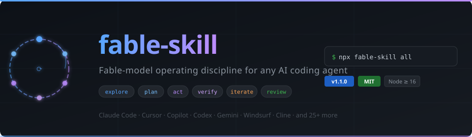

<p align="center">
  
</p>

# fable-skill

**Fable-model operating discipline for any AI coding agent.**

One skill that upgrades how your agent *works* — not what it knows. It enforces the working
discipline that separates top-tier agentic models from ordinary runs: explore before planning,
plan before acting, verify every change with evidence, debug at root cause instead of retrying
blindly, persist state across long tasks, and self-review before declaring done.

Install it once with `npx`, natively, into whichever agent you use:

| | | | |
|---|---|---|---|
| Claude Code | Cursor | GitHub Copilot | OpenAI Codex |
| Gemini CLI / Antigravity | Windsurf | Cline | Roo Code |
| Amp | OpenClaw / ClawBot | Aider | Continue.dev |
| Zed | JetBrains Junie | Kiro (AWS) | Trae |
| Qwen Code | OpenCode | Goose | Warp |
| Kilo Code | Augment | OpenHands | Replit Agent |
| any AGENTS.md agent | claude.ai (zip) | | |

## Quick start

```bash
# Claude Code, available in every project
npx github:almutaz9000/fable-skill claude --global

# OpenAI Codex, available in every project (~/.agents/skills/fable-skill/)
npx github:almutaz9000/fable-skill codex --global

# Cursor rules for the current repo
npx github:almutaz9000/fable-skill cursor

# AGENTS.md block — picked up by Codex, Amp, Jules, Zed, Factory, and others
npx github:almutaz9000/fable-skill agents

# Everything at once for the current repo
npx github:almutaz9000/fable-skill all

# See every supported agent and where it installs
npx github:almutaz9000/fable-skill list
```

No dependencies, no build step, Node ≥ 16. The installer is idempotent — re-run it any time
to update; shared files like `AGENTS.md` are edited only between managed markers, so your own
content is never touched.

## What's in the skill

The skill is plain markdown — a core protocol plus six focused modules. Agents with native
skill support (Claude Code, OpenAI Codex, OpenClaw) get the folder as-is and load modules on demand; agents
with a single rules file get everything merged into one document in their native format.

| Module | What it enforces |
|---|---|
| [`SKILL.md`](skill/SKILL.md) | The Fable Loop: understand → explore → plan → act → verify → iterate → review, plus the non-negotiable rules |
| [`reasoning.md`](skill/references/reasoning.md) | Hypothesis trees for debugging, decision rubrics, self-consistency checks, assumption ledgers, altitude control when stuck |
| [`planning.md`](skill/references/planning.md) | Checkable done-criteria, plan templates, decomposition heuristics (riskiest assumption first, vertical slices), replanning rules |
| [`execution.md`](skill/references/execution.md) | Parallel tool batching, wide-fan exploration, subagent delegation, minimal-diff editing discipline |
| [`verification.md`](skill/references/verification.md) | The evidence standard ("it should work" is banned), a five-rung verification ladder, root-cause debugging protocol |
| [`context.md`](skill/references/context.md) | STATE.md pattern so long tasks survive context compaction and session breaks |
| [`communication.md`](skill/references/communication.md) | Outcome-first reporting, honesty rules, readability over compression |

## Per-agent install locations

| Agent | Command | Installs to |
|---|---|---|
| Claude Code | `claude --global` / `claude` | `~/.claude/skills/fable-skill/` or `.claude/skills/fable-skill/` |
| Cursor | `cursor` | `.cursor/rules/fable-skill.mdc` (always-apply rule) |
| GitHub Copilot | `copilot` | `.github/instructions/fable-skill.instructions.md` |
| Windsurf | `windsurf` | `.windsurf/rules/fable-skill.md` (always-on) |
| Cline | `cline --global` / `cline` | `~/Documents/Cline/Rules/` or `.clinerules/` |
| Roo Code | `roo` | `.roo/rules/fable-skill.md` |
| OpenAI Codex | `codex --global` / `codex` | `~/.agents/skills/fable-skill/` or `.agents/skills/fable-skill/` |
| Gemini CLI / Antigravity | `gemini --global` / `gemini` | `~/.gemini/GEMINI.md` or `./GEMINI.md` (managed block) |
| Amp | `amp` | `./AGENTS.md` (managed block) |
| OpenClaw / ClawBot | `openclaw --global` / `openclaw` | `~/.openclaw/skills/fable-skill/` or `./skills/fable-skill/` |
| Aider | `aider` | `./CONVENTIONS.md` (managed block; load with `--read CONVENTIONS.md`) |
| Continue.dev | `continue --global` / `continue` | `~/.continue/rules/` or `.continue/rules/` |
| Zed | `zed` | `./.rules` (managed block) |
| JetBrains Junie | `junie` | `.junie/guidelines.md` (managed block) |
| Kiro (AWS) | `kiro` | `.kiro/steering/fable-skill.md` |
| Trae | `trae` | `.trae/rules/fable-skill.md` |
| Qwen Code | `qwen --global` / `qwen` | `~/.qwen/QWEN.md` or `./QWEN.md` (managed block) |
| OpenCode | `opencode --global` / `opencode` | `~/.config/opencode/AGENTS.md` or `./AGENTS.md` (managed block) |
| Goose (Block) | `goose` | `./.goosehints` (managed block) |
| Warp | `warp` | `./WARP.md` (managed block) |
| Kilo Code | `kilo` | `.kilocode/rules/fable-skill.md` |
| Augment Code | `augment` | `.augment/rules/fable-skill.md` |
| OpenHands | `openhands` | `.openhands/microagents/repo.md` (managed block) |
| Replit Agent | `replit` | `./replit.md` (managed block) |
| AGENTS.md standard | `agents` | `./AGENTS.md` (managed block) |

**claude.ai:** zip the [`skill/`](skill/) folder (it must contain `SKILL.md` at its root) and
upload it under **Settings → Capabilities → Skills**.

**Any agent not listed:** copy [`skill/`](skill/) into wherever your agent reads instructions,
or paste the merged output of `SKILL.md` + `references/*.md` into its system prompt / rules file.

## What it does (and honestly, what it doesn't)

A skill is instructions, not weights. It cannot transfer raw model intelligence. What it *can*
transfer is process — and in agentic work, process failures (acting on unread code, claiming
success without running anything, retrying the same fix, losing state mid-task) account for a
large share of the quality gap between model tiers. This skill closes those by policy:

- **Never act on assumption** — read the code, run the command, get ground truth first.
- **Never claim without evidence** — every "it works" must cite output that would differ if it didn't.
- **Never retry verbatim** — two failures at the same subgoal force a change of hypothesis or altitude.
- **Never lose state** — long tasks keep a STATE.md that survives context compaction.
- **Never skip the review** — a hostile self-review gates every "done".

Expect the biggest gains on process-heavy work: debugging, refactors, migrations, research,
multi-step automation.

## Repo layout

```
fable-skill/
├── skill/                 # the skill itself (canonical source, plain markdown)
│   ├── SKILL.md
│   └── references/
│       ├── reasoning.md
│       ├── planning.md
│       ├── execution.md
│       ├── verification.md
│       ├── context.md
│       └── communication.md
├── bin/cli.js             # zero-dependency npx installer
└── package.json
```

## Contributing

Improvements to the discipline itself (sharper rules, better protocols, new agent targets for
the installer) are welcome — open an issue or PR. Keep rules falsifiable and behavioral:
"never X without Y" beats "try to be careful".

## License

[MIT](LICENSE)
